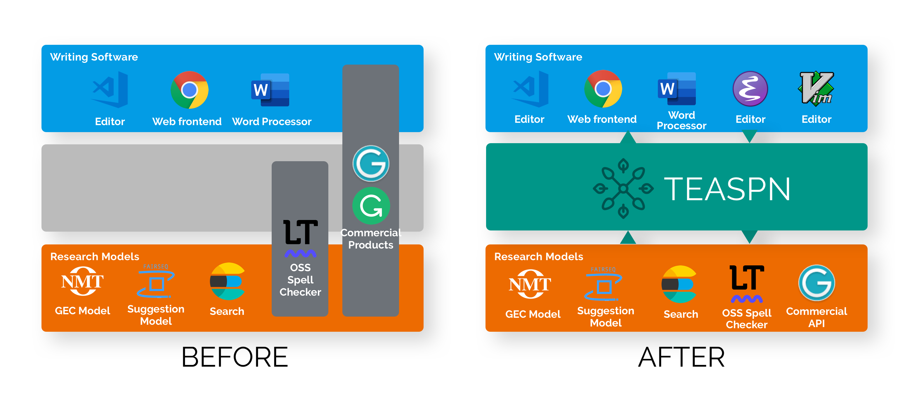

Framework and Protocol for Integrated Writing Assistance Environments
{: .fs-6 .fw-300 }

[Specification]({{ site.baseurl }}){: .btn .btn-primary .fs-5 .mb-4 .mb-md-0 .mr-2 } [View SDK on GitHub](https://github.com/teaspn/teaspn){: .btn .fs-5 .mb-4 .mb-md-0 }

---

## What is TEASPN?

TEASPN (Text Editing Assistance Smartness Protocol for Natural Language; pronounced "teaspoon") is a protocol and a framework for providing integrated writing assistance environments. It defines a set of APIs that writing software (e.g., text editors) uses to communicate with language smartness providers (e.g., grammatical error correction systems).

## Why TEASPN?

Traditionally, it takes great effort for developers to integrate language smartness features (such as spell correction and completion) into writing software. Also, there's been great progress on writing assistance technologies such as [grammatical error correction](http://nlpprogress.com/english/grammatical_error_correction.html) and text generation/completion in academia, although real-world applications are yet to reap the benefit from these research efforts, mainly due to the high cost of implementing them in a user-facing way.

There are a few commercial products (notably, [Grammarly](https://www.grammarly.com/) and [Ginger](https://www.gingersoftware.com/)) which provide users with integrated writing experience, although they typically support a limit range of writing software that they can integrate with, nor is it easy for developers to extend them with language smartness technologies.

By adopting TEASPN,

* users (writers) can benefit from integrated writing experience provided by text editors and language smartness providers, 
* developers of writing software can integrate state-of-the-art language smartness functionalities into their editors and word processors just by following the protocol, and 
* developers of language technologies (e.g., NLP researchers) can integrate their state-of-the-art language smartness technologies to major writing software without worrying about implementing user-facing features.

## Specifications

TEASPN is greatly inspired by and built upon [Language Server Protocol (LSP)](https://microsoft.github.io/language-server-protocol/), which defines the protocol used by programming software (e.g., IDEs, or integrated development environments) and servers that provide language features (e.g., completion). You can think of TEASPN as a "fork" of LSP that is specifically designed for editing natural language text.

For the details, please refer to the [specification page]({{ site.baseurl }}).

## TEASPN SDK (Software Development Kit)

We provide the TEASPN SDK.

## About the project

See [the about page]({{ site.baseurl }}).

&copy; 2019 TEASPN developers. All Rights Reserved.
